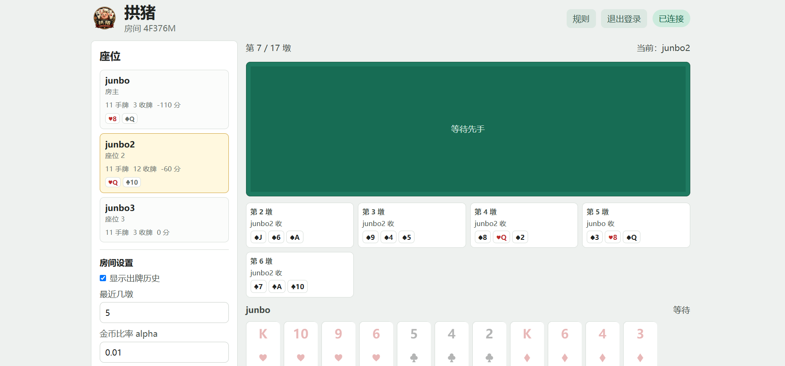
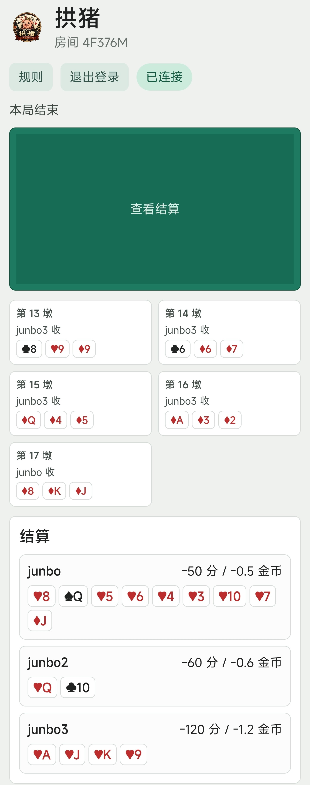
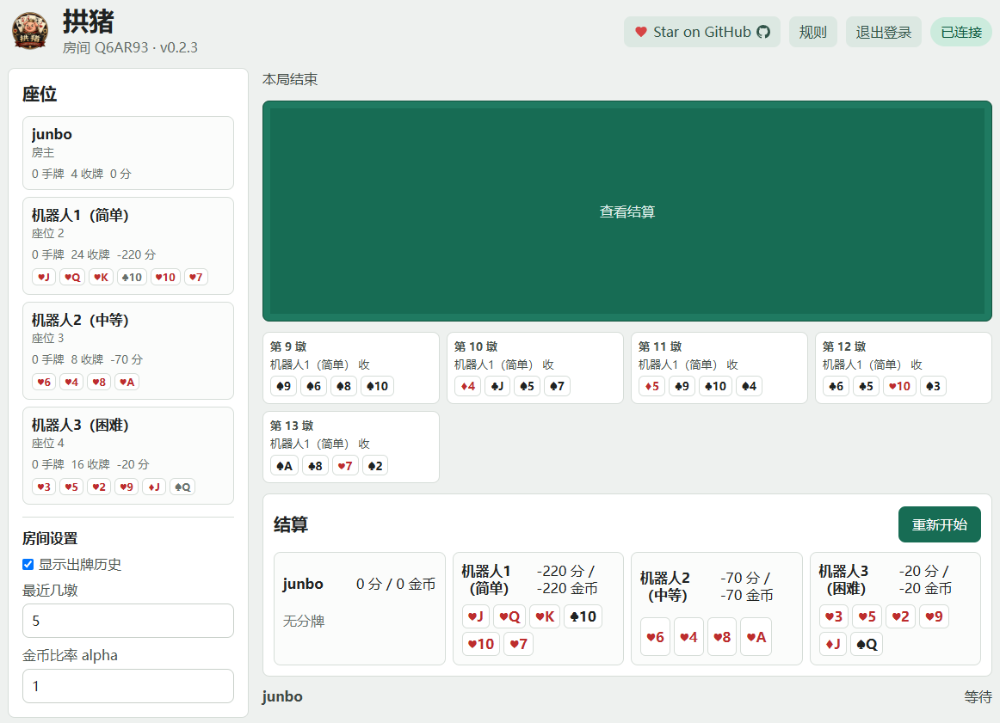

# 拱猪 Sable Hearts


多人扑克牌线上网页游戏。

## 服务启动

安装依赖：

```powershell
npm install
```

构建前端：

```powershell
npm run build
```

启动服务：

```powershell
npm start
```

打开：

```url
http://localhost:3000
```

如果3000端口被占用：

```powershell
$env:PORT=3001
npm start
```

然后打开：

```url
http://localhost:3001
```

## 朋友加入

房主创建房间后，页面会显示类似：

```url
http://localhost:3000/room/A8K3QZ
```

如果朋友和你在同一个局域网，把`localhost`换成你的电脑局域网IP：

```url
http://192.168.1.23:3000/room/A8K3QZ
```

朋友打开链接，注册或登录账号后即可加入。

不在同一局域网时，可以用`Cloudflare Tunnel`临时暴露本机服务：

```powershell
cloudflared tunnel --url http://localhost:3000
```

它会输出一个公网地址，例如：

```url
https://example.trycloudflare.com
```

把房间链接改成：

```url
https://example.trycloudflare.com/room/A8K3QZ
```

发给朋友即可。

或者进入部署的免费[Render Web Service](https://sable-hearts.onrender.com)进行游戏。

## 添加人机

房主创建房间后，在开始游戏前，除了等待真实玩家加入，也可以在空座位上添加人机来替代真实玩家。人机有四档难度：

```text
愚蠢：仅在合法牌中随机出牌
简单：简单启发式，会跟花色、尽量少送分、垫牌时优先甩大分牌
中等：使用公开信息记牌、缺门推断和局面评分
困难：在中等策略上抽样可能的隐藏手牌并推演后续牌局
```

人机只能在开局前添加或移除，游戏进行中不支持替换真人。

## 游戏规则

人数和牌数：

```text
3人：1副牌，移除红心2，每人 51/3=17 张
4人：1副牌，不移除，每人 52/4=13 张
5人：1副牌，移除红心2、3，每人 50/5=10 张
6人：2副牌，移除两张红心2，每人 102/6=17 张
7人：2副牌，移除两张红心2、3、4，每人 98/7=14 张
```

出牌规则：

```text
每墩先手可任意出牌
后手有首出花色必须跟花色
没有首出花色可以任意垫牌
只有首出花色可以赢这一墩
同花色 2 < 3 < ... < 10 < J < Q < K < A
两副牌出现相同牌时，后出的相同牌比先出的小
```

计分规则：

```text
黑桃Q：-100
方块J：+100
红心5-10：每张-10
红心J：-20
红心Q：-30
红心K：-40
红心A：-50
梅花10：总分x2
只吃到1张梅花10：+50
两副牌只吃到2张梅花10：+200
全收集1套红心：该套红心的负分全变正分，且可带一张黑桃Q变正分，多余的红心和黑桃Q仍为负分（两副牌情况下）
全收集2套红心：所有负分全变正分，且额外翻2倍
1副牌下全收所有红心、黑桃Q、方块J、梅花10：(-(-60-20-30-40-50-100)+100)x2=+800
2副牌下全收所有红心、两张黑桃Q、两张方块J、两张梅花10：(-(-60-20-30-40-50-100)+100)x2x4x2=+6400
1副牌下分摊每人平均而言-100分左右，2副牌下分摊每人平均而言-200分左右
```

金币规则：
```text
房主可设置分数兑换金币的比率alpha
当某玩家分数为负a分时，该玩家负a*alpha金币
当某玩家分数为正a分时，均匀让其他n-1名玩家额外负a/(n-1)*alpha金币，该玩家则0金币
```

## Demo




